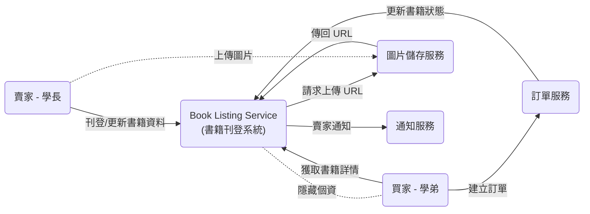
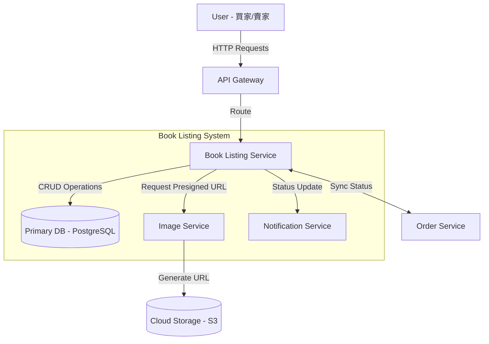
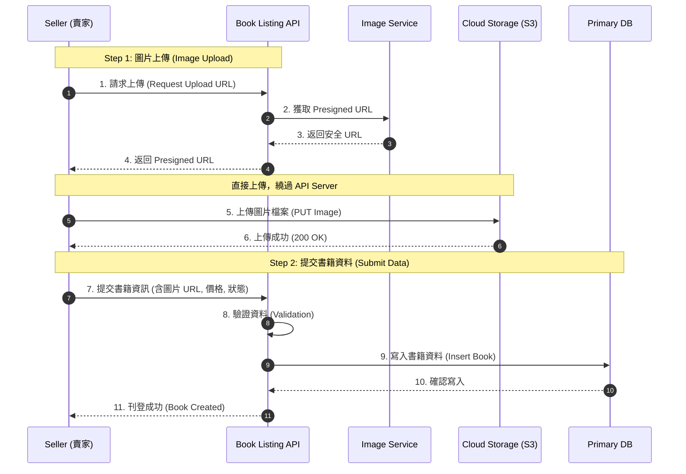
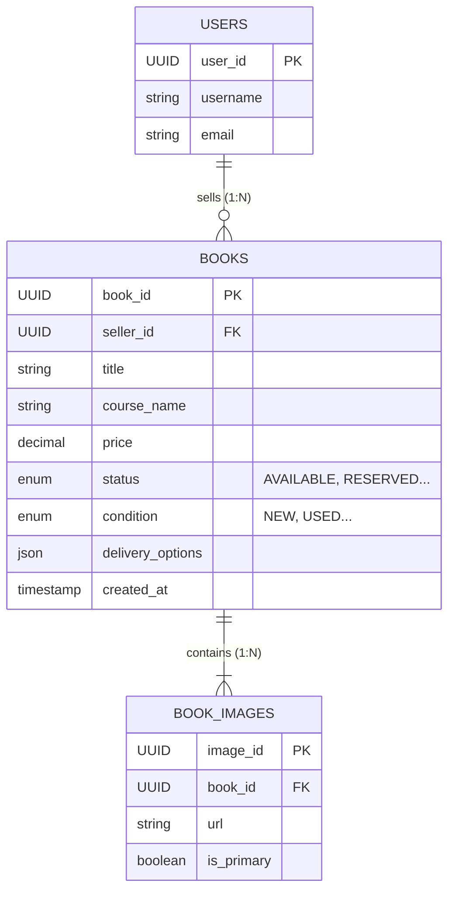

# 📚 書籍展示與交易選項 - 技術設計文件 (Book Display SDD)

## 1. Introduction
- **Purpose**: 定義「書籍展示與刊登模組」的技術架構、API 規格、資料模型以及關鍵流程設計。確保將功能需求（如：多圖支援、狀態管理）和非功能性需求（如：圖片安全性、買賣雙方隱私）轉換為可執行的工程方案。
- **Scope**:
    * **In Scope (範圍內)**: 賣家書籍刊登 API (`POST /books`)、買家獲取書籍詳情 API (`GET /books/{id}`)、圖片上傳安全流程、書籍狀態機設計、交易選項動態展示邏輯、隱私中介機制。
    * **Out of Scope (範圍外)**: 實際金流支付與扣款流程（由金流服務模組處理）、站內信箱即時通訊服務。
- **Definitions and Acronyms**:
    * **TDD/SDD**: 技術設計文件 (Technical/Software Design Document)。
    * **Payload**: 惡意輸入或用於測試安全性的資料，這裡特指圖片上傳時防止潛在的惡意程式碼。
    * **Status State Machine**: 書籍從「刊登中」到「已售出」的狀態轉換邏輯。
    * **Presigned URL**: 預簽名 URL，用於安全且有時效性地將檔案直接上傳到雲端儲存空間。
- **References**:
    * [功能需求文件] `../requirement/book_display_requirement.md`
    * [專案總覽] `../README.md`
---
## 2. System Overview

### System Description (系統描述)
書籍展示與刊登模組是一個使用者導向的子系統，負責處理賣家（學長）的產品資訊輸入、圖片處理、狀態管理，以及向買家（學弟）呈現書籍詳情和可用的交易選項。它是連接賣家與訂單處理系統的門戶。

---

### Design Goals (設計目標)

* **Usability (可用性):** 實現簡潔直觀的刊登流程，減少賣家上架時間 (NFR-BD-U-001)。
* **Security (安全性):** 嚴格執行圖片上傳檢查（防止惡意 payload），並確保買賣雙方在交易過程中全程保持隱私 (NFR-BD-S-001, NFR-BD-S-002)。
* **Maintainability (可維護性):** 採用清晰定義的狀態機 (State Machine) 來管理書籍狀態，以利於日後追蹤和維護交易流程。
* **Performance (效能):** 優化圖片處理和資料載入，確保書籍展示頁面快速響應 (NFR-BD-P-001)。

---

### Architecture Summary (架構摘要)

本模組預計採用**微服務架構 (Microservices)** 的其中一個服務來實現。

* **服務名稱:** `Book-Listing-Service`
* **職責:** 專注於書籍資料的 CRUD (創建、讀取、更新、刪除) 操作、庫存狀態管理，以及處理與**專門圖片服務 (Image Service)** 的互動。
* **依賴:** 依賴獨立的 **Image Service** 處理圖片的格式檢查和儲存；依賴 **Notification Service** 在購買時通知賣家 (FR-BD-007)。

---

### System Context Diagram (上下文交換圖)



---
## 3. Architectural Design
---
### System Architecture Diagram (系統架構圖)



### Component Breakdown (組件拆解)

| 組件名稱 (Component) | 職責 (Responsibilities) | 互動對象 (Interactions) |
| :--- | :--- | :--- |
| **Book Listing API** | 負責處理所有書籍相關的 HTTP 請求（刊登、更新、刪除、查詢詳情）；執行身份驗證與輸入資料驗證（如：檢查必填欄位、價格合理性）。 | 接收來自 **API Gateway** 的流量；對 **Primary DB** 進行 CRUD 操作。 |
| **Status Management Logic** | 核心業務邏輯，負責管理書籍的生命週期狀態 (State Machine)。確保書籍從「刊登中」正確流轉至「已保留」或「已售出」，防止狀態不一致。 | 監聽 **Order Service** 的訂單事件；觸發 **Notification Service** 發送通知給賣家。 |
| **Image Handler** | 專門處理圖片上傳的安全性流程。它不直接接收圖片檔案，而是負責向圖片服務請求上傳憑證。 | 呼叫獨立的 **Image Service** 獲取 Presigned URL；將上傳成功後的最終 URL 存入資料庫。 |

### Technology Stack (技術堆疊)

| 類別 (Category) | 技術選型 (Technology) | 選擇理由 (Rationale) |
| :--- | :--- | :--- |
| **Backend Framework** | **Python (FastAPI)** 或 **Node.js (NestJS)** | 提供高效能的非同步處理能力，適合處理大量的 I/O 操作（如頻繁的資料庫讀寫和外部 API 呼叫）。 |
| **Primary Database** | **PostgreSQL** | 強大的關聯式資料庫，支援複雜查詢與 ACID 事務特性，確保書籍庫存與交易狀態的一致性。 |
| **Object Storage** | **AWS S3** 或 **Google Cloud Storage** | 用於儲存書籍圖片（非結構化資料），提供高可用性、擴展性以及原生的 Presigned URL 安全上傳功能。 |
| **Communication** | **RESTful API** | 對前端提供標準 REST API，方便與網頁或 App 端整合。 |

### Data Flow and Control Flow:


---
## 4. Detailed Design
---
### Responsibilities (職責)
**Book Listing Service** 的主要職責是管理書籍的完整生命週期與展示資訊。具體包括：
1.  **書籍管理 (CRUD):** 處理賣家刊登、編輯、下架書籍的請求，並驗證資料完整性（如價格非負、必填欄位）。
2.  **圖片協調 (Image Coordination):** 與 Image Service 協作，生成圖片上傳憑證 (Presigned URL)，確保圖片不經過應用伺服器，直接安全上傳至雲端。
3.  **狀態守門員 (Status Gatekeeper):** 嚴格執行狀態轉換邏輯（例如：防止已售出的書籍被重複購買），確保資料庫中的庫存狀態是唯一的信任來源 (Source of Truth)。

### Interfaces/APIs (介面與 API)

#### 1. Create Book API (`POST /api/v1/books`)
* **Inputs (輸入資料):**
    * `Headers`: Authorization (Bearer Token)
    * `Body`:
        ```json
        {
          "title": "Introduction to Algorithms",
          "course_name": "演算法",
          "price": 500,
          "condition": "USED",  // Enum: NEW, USED, etc.
          "delivery_options": ["FACE_TO_FACE", "CONVENIENCE_STORE"],
          "image_urls": ["[https://s3.aws](https://s3.aws).../img1.jpg", "..."] // 預先上傳後的 URL
        }
        ```
* **Outputs (輸出資料):**
    * `201 Created`: `{"book_id": "uuid-1234", "status": "AVAILABLE", "created_at": "..."}`
    * `400 Bad Request`: 輸入資料驗證失敗（例如：缺少圖片 URL）。

#### 2. Get Book Details API (`GET /api/v1/books/{book_id}`)
* **Inputs (輸入資料):**
    * `Path Parameter`: `book_id` (UUID)
* **Outputs (輸出資料):**
    * `200 OK`: 返回書籍完整資訊 JSON，**但不包含賣家聯絡方式**。
    * `404 Not Found`: 書籍不存在或已封存。

### Error Handling (錯誤處理策略)
* **輸入驗證 (Input Validation):** 採用 "Fail-fast" 策略。在進入業務邏輯前，使用 Schema Validator (如 Pydantic/Joi) 檢查必填欄位、價格範圍及 Enum 合法性。若失敗直接回傳 `400`。
* **狀態衝突 (State Conflict):** 當嘗試對「已售出」的書籍進行操作時，拋出自定義 `InvalidStateException`，並回傳 `409 Conflict`。
* **圖片安全 (Image Security):** 若 Image Service 回報圖片含有惡意 Payload，則拒絕刊登請求，並記錄安全警示 Log。

### Data Structures (關鍵資料結構)
* **Book Model (Schema):**
    * `id`: UUID (PK)
    * `seller_id`: UUID (FK, Indexed)
    * `status`: ENUM (`AVAILABLE`, `RESERVED`, `SOLD`, `ARCHIVED`)
    * `condition`: ENUM (`NEW`, `LIKE_NEW`, `USED`, `POOR`)
    * `meta_data`: JSONB (用於儲存非結構化的描述或標籤)
* **DeliveryOption Enum:** 定義合法的取貨方式常數，避免字串拼寫錯誤。

### Algorithms/Logic (演算法與邏輯)
* **Presigned URL 生成邏輯:**
    1.  接收前端請求（含檔案類型、大小）。
    2.  驗證賣家權限。
    3.  呼叫 AWS S3/GCS SDK 生成帶有 `expiresIn=300s` (5分鐘) 與 `Content-Type` 限制的簽名 URL。
* **原子性狀態更新 (Atomic Status Update):**
    * 為了防止「超賣」 (Over-selling)，狀態更新必須使用資料庫層級的原子操作或鎖機制：
    * `UPDATE books SET status = 'RESERVED' WHERE id = :id AND status = 'AVAILABLE';`
    * 檢查受影響行數 (Rows Affected)，若為 0 則表示書籍已被搶走，交易失敗。

### State Management (狀態管理)
* **Single Source of Truth:** 所有書籍狀態僅以 **Primary Database** 中的 `status` 欄位為準，不依賴記憶體快取 (Cache) 來做交易決策。
* **State Machine:** 應用層實作狀態機模式，定義合法的轉換路徑（例如：只能從 `AVAILABLE` -> `RESERVED`），拒絕任何非法的狀態跳轉請求。

---

## 5. Database Design

---

### ER Diagram



### Tables/Collections (資料表定義)

我們採用關聯式資料庫 (PostgreSQL) 來確保資料的一致性與結構化查詢能力。

#### 1. Books Table (書籍資料表)
儲存書籍的核心資訊、交易狀態與賣家設定。

| 欄位名稱 (Field) | 資料類型 (Type) | 屬性與約束 (Constraints) | 說明 (Description) |
| :--- | :--- | :--- | :--- |
| `book_id` | UUID | **PK**, NOT NULL | 書籍唯一識別碼 (Primary Key)。 |
| `seller_id` | UUID | **Indexed**, NOT NULL | 關聯至 User Service 的賣家 ID。 |
| `title` | VARCHAR(255) | NOT NULL | 書籍名稱。 |
| `course_name` | VARCHAR(100) | NULLABLE | 對應課程名稱，支援搜尋用。 |
| `price` | DECIMAL(10, 2) | NOT NULL, CHECK(`price` >= 0) | 售價，必須為非負數。 |
| `status` | VARCHAR(20) | NOT NULL, DEFAULT `'AVAILABLE'` | 狀態 Enum: `AVAILABLE`, `RESERVED`, `SOLD`, `ARCHIVED`。 |
| `condition` | VARCHAR(20) | NOT NULL | 新舊程度 Enum: `NEW`, `LIKE_NEW`, `USED`, `POOR`。 |
| `delivery_options`| JSONB | NOT NULL | 儲存陣列格式的取貨選項，例如 `["FACE_TO_FACE", "7-11"]`。 |
| `created_at` | TIMESTAMP | DEFAULT NOW() | 建立/上架時間。 |
| `updated_at` | TIMESTAMP | DEFAULT NOW() | 最後修改時間。 |

#### 2. Book_Images Table (書籍圖片表)
儲存書籍對應的圖片 URL，支援一本書多張圖片。

| 欄位名稱 (Field) | 資料類型 (Type) | 屬性與約束 (Constraints) | 說明 (Description) |
| :--- | :--- | :--- | :--- |
| `image_id` | UUID | **PK**, NOT NULL | 圖片唯一識別碼。 |
| `book_id` | UUID | **FK**, NOT NULL, ON DELETE CASCADE | 關聯至 `Books` 表的 Foreign Key。 |
| `url` | TEXT | NOT NULL | 雲端儲存空間 (S3) 的完整 URL。 |
| `is_primary` | BOOLEAN | DEFAULT FALSE | 是否為列表頁顯示的封面圖。 |
| `uploaded_at` | TIMESTAMP | DEFAULT NOW() | 上傳時間。 |

---

### Relationships (實體關係)

* **Seller to Books (1:N):**
    * 一個賣家 (`seller_id`) 可以刊登多本書籍。
    * 在 `Books` 表中建立 `seller_id` 的索引 (Index) 以優化 "查詢某賣家的所有書籍" 的效能。

* **Book to Images (1:N):**
    * 一本書 (`book_id`) 可以擁有多張圖片。
    * 關係由 `Book_Images.book_id` 作為外鍵 (Foreign Key) 參考 `Books.book_id`。
    * 設定 `ON DELETE CASCADE`，當
---
### Migration Strategy (遷移策略)

由於這是全新專案，我們將採用 **Initial Schema Creation** 策略。

1.  **版本控制:** 使用資料庫遷移工具 (如 Flyway 或 Alembic) 來管理 Schema 變更。所有的 DDL (Create, Alter) 語句都將存為版本化的 SQL 檔案 (例如 `V1__init_books_schema.sql`)。
2.  **初始部署:** 在專案初始化階段，執行 V1 腳本建立 `books` 與 `book_images` 表及相關索引。
3.  **Rollback 機制:** 每個遷移腳本都必須對應一個 `down` 腳本 (Revert script)，以確保在部署失敗時能安全回滾資料庫狀態。
   
---

## 6. External Interfaces

---

### User Interface (使用者介面)
本模組提供兩個核心的 Web 介面（Responsive Web Design）：

1.  **賣家刊登頁面 (Seller Listing Page):**
    * **Drag-and-Drop Upload:** 支援拖曳上傳圖片，並提供上傳進度條與預覽功能。
    * **Form Validation:** 即時檢查必填欄位（書名、價格），並以紅框提示錯誤。
    * **UX Note:** 針對手機端優化，方便使用者直接調用相機拍照上傳。

2.  **書籍詳情頁面 (Book Detail Page):**
    * **Image Gallery:** 支援圖片輪播 (Carousel) 與點擊放大檢視，以利買家檢查書籍瑕疵。
    * **Status Badges:** 清晰顯示書籍目前狀態（如 `Available` 為綠色，`Reserved` 為黃色）。
    * **Privacy View:** 確保頁面上完全隱藏賣家的個人聯絡資訊 (Email/Phone)。

### External APIs (外部 API 整合)

本服務依賴以下外部系統或內部微服務介面：

* **Cloud Storage API (AWS S3 / Google Cloud Storage):**
    * 用於生成 Presigned URL 以及由前端直接執行 `PUT` 請求上傳圖片檔案。
* **Image Service (Internal):**
    * 提供 gRPC 接口 `GenerateUploadUrl`，負責與雲端儲存溝通簽發憑證。
* **Order Service (Internal):**
    * 提供 Webhook 或 Message Queue 事件，通知本服務鎖定書籍狀態 (`LockInventory`)。
* **Notification Service (Internal):**
    * 接收本服務發出的 `SellerNotification` 事件，發送 Email 或站內信。

### Hardware Interfaces (硬體介面)
* **N/A (不適用):** 本系統為純軟體 Web 服務，無直接的專用硬體介面。
* **Client Side:** 依賴使用者裝置（手機/電腦）的 **相機 (Camera)** 與 **檔案系統 (File System)** 進行照片拍攝與選取。

### Network Protocols/Communication (網路協定與通訊)

| 通訊類型 | 協定 (Protocol) | 資料格式 (Format) | 用途 |
| :--- | :--- | :--- | :--- |
| **Client-Server** | **HTTPS (REST)** | JSON | 前端網頁與後端 API 溝通。強制使用 TLS 1.2+ 加密。 |
| **Inter-Service** | **gRPC** | Protobuf | 微服務內部通訊 (例如: Listing Service <-> Image Service)，追求低延遲與高效能。 |
| **Image Upload** | **HTTPS (PUT)** | Binary (Image Blob) | 前端直接傳輸二進制圖片檔至雲端儲存。 |

---

