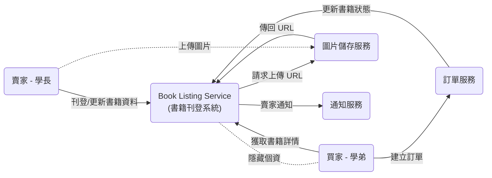
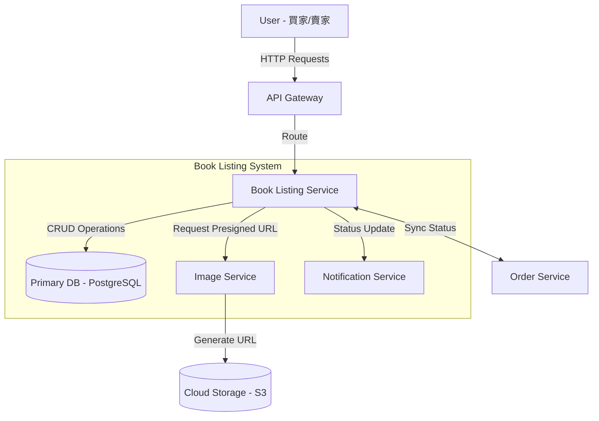

# 📚 書籍展示與交易選項 - 技術設計文件 (Book Display SDD)

## 1. Introduction
- **Purpose**: 定義「書籍展示與刊登模組」的技術架構、API 規格、資料模型以及關鍵流程設計。確保將功能需求（如：多圖支援、狀態管理）和非功能性需求（如：圖片安全性、買賣雙方隱私）轉換為可執行的工程方案。
- **Scope**:
    * **In Scope (範圍內)**: 賣家書籍刊登 API (`POST /books`)、買家獲取書籍詳情 API (`GET /books/{id}`)、圖片上傳安全流程、書籍狀態機設計、交易選項動態展示邏輯、隱私中介機制。
    * **Out of Scope (範圍外)**: 實際金流支付與扣款流程（由金流服務模組處理）、站內信箱即時通訊服務。
- **Definitions and Acronyms**:
    * **TDD/SDD**: 技術設計文件 (Technical/Software Design Document)。
    * **Payload**: 惡意輸入或用於測試安全性的資料，這裡特指圖片上傳時防止潛在的惡意程式碼。
    * **Status State Machine**: 書籍從「刊登中」到「已售出」的狀態轉換邏輯。
    * **Presigned URL**: 預簽名 URL，用於安全且有時效性地將檔案直接上傳到雲端儲存空間。
- **References**:
    * [功能需求文件] `../requirement/book_display_requirement.md`
    * [專案總覽] `../README.md`
---
## 2. System Overview

### System Description (系統描述)
書籍展示與刊登模組是一個使用者導向的子系統，負責處理賣家（學長）的產品資訊輸入、圖片處理、狀態管理，以及向買家（學弟）呈現書籍詳情和可用的交易選項。它是連接賣家與訂單處理系統的門戶。

---

### Design Goals (設計目標)

* **Usability (可用性):** 實現簡潔直觀的刊登流程，減少賣家上架時間 (NFR-BD-U-001)。
* **Security (安全性):** 嚴格執行圖片上傳檢查（防止惡意 payload），並確保買賣雙方在交易過程中全程保持隱私 (NFR-BD-S-001, NFR-BD-S-002)。
* **Maintainability (可維護性):** 採用清晰定義的狀態機 (State Machine) 來管理書籍狀態，以利於日後追蹤和維護交易流程。
* **Performance (效能):** 優化圖片處理和資料載入，確保書籍展示頁面快速響應 (NFR-BD-P-001)。

---

### Architecture Summary (架構摘要)

本模組預計採用**微服務架構 (Microservices)** 的其中一個服務來實現。

* **服務名稱:** `Book-Listing-Service`
* **職責:** 專注於書籍資料的 CRUD (創建、讀取、更新、刪除) 操作、庫存狀態管理，以及處理與**專門圖片服務 (Image Service)** 的互動。
* **依賴:** 依賴獨立的 **Image Service** 處理圖片的格式檢查和儲存；依賴 **Notification Service** 在購買時通知賣家 (FR-BD-007)。

---

### System Context Diagram (上下文交換圖)

---
## 3. Architectural Design
---
### System Architecture Diagram (系統架構圖)

### Component Breakdown (組件拆解)

| 組件名稱 (Component) | 職責 (Responsibilities) | 互動對象 (Interactions) |
| :--- | :--- | :--- |
| **Book Listing API** | 負責處理所有書籍相關的 HTTP 請求（刊登、更新、刪除、查詢詳情）；執行身份驗證與輸入資料驗證（如：檢查必填欄位、價格合理性）。 | 接收來自 **API Gateway** 的流量；對 **Primary DB** 進行 CRUD 操作。 |
| **Status Management Logic** | 核心業務邏輯，負責管理書籍的生命週期狀態 (State Machine)。確保書籍從「刊登中」正確流轉至「已保留」或「已售出」，防止狀態不一致。 | 監聽 **Order Service** 的訂單事件；觸發 **Notification Service** 發送通知給賣家。 |
| **Image Handler** | 專門處理圖片上傳的安全性流程。它不直接接收圖片檔案，而是負責向圖片服務請求上傳憑證。 | 呼叫獨立的 **Image Service** 獲取 Presigned URL；將上傳成功後的最終 URL 存入資料庫。 |

### Technology Stack (技術堆疊)

| 類別 (Category) | 技術選型 (Technology) | 選擇理由 (Rationale) |
| :--- | :--- | :--- |
| **Backend Framework** | **Python (FastAPI)** 或 **Node.js (NestJS)** | 提供高效能的非同步處理能力，適合處理大量的 I/O 操作（如頻繁的資料庫讀寫和外部 API 呼叫）。 |
| **Primary Database** | **PostgreSQL** | 強大的關聯式資料庫，支援複雜查詢與 ACID 事務特性，確保書籍庫存與交易狀態的一致性。 |
| **Object Storage** | **AWS S3** 或 **Google Cloud Storage** | 用於儲存書籍圖片（非結構化資料），提供高可用性、擴展性以及原生的 Presigned URL 安全上傳功能。 |
| **Communication** | **RESTful API** | 對前端提供標準 REST API，方便與網頁或 App 端整合。 |
