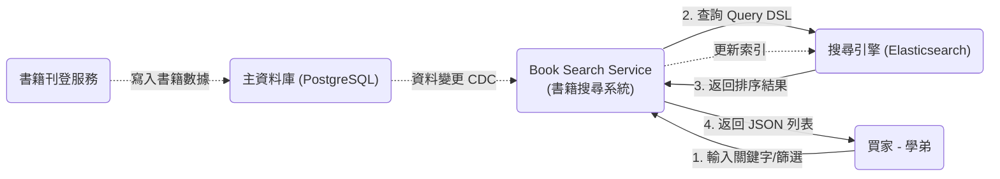

# 🔍 書籍搜尋系統 - 技術設計文件 (Book Search SDD)

## 1. Introduction

- **Purpose**: 定義「書籍搜尋模組」的技術架構、索引策略與查詢邏輯。旨在解決傳統關聯式資料庫無法滿足的高效能全文檢索與多維度篩選（書名、課程、老師）需求。
- **Scope**:
    * **In Scope (範圍內)**: 書籍搜尋 API (`GET /search/books`)、搜尋引擎 (Elasticsearch) 的索引結構設計 (Mapping)、加權排序演算法 (Ranking Logic)、資料庫與搜尋引擎之間的資料同步機制 (Data Sync)。
    * **Out of Scope (範圍外)**: 書籍的實際交易處理、圖片儲存細節（由 `book_display` 模組處理）。
- **Definitions and Acronyms**:
    * **Elasticsearch (ES)**: 分散式搜尋與分析引擎，本系統的核心組件，用於全文檢索。
    * **Inverted Index (倒排索引)**: 搜尋引擎使用的核心資料結構，用於快速將關鍵字映射到文檔。
    * **Relevance Score (關聯性分數)**: 根據匹配程度（如 TF-IDF/BM25 演算法）計算出的分數，用於搜尋結果排序。
    * **CDC (Change Data Capture)**: 變更資料擷取，指即時捕捉資料庫變更並同步到搜尋引擎的技術模式。
- **References**:
    * [功能需求文件] `../requirement/book_search_requirement.md`
    * [書籍展示設計] `../design/book_display_design.md` (定義了書籍原始資料來源)
    * [專案總覽] `../README.md`

---

## 2. System Overview

### System Description (系統描述)
書籍搜尋系統是一個專門優化讀取效能 (Read-Optimized) 的服務。它從主資料庫中同步書籍資料，建立全文索引，並提供一個低延遲的查詢介面，讓買家能透過書名、課程名稱、老師姓名等模糊關鍵字快速找到所需書籍。

### Design Goals (設計目標)

* **Performance (效能):** 確保 95% 的搜尋請求能在 **500ms** 內返回結果 (NFR-BS-P-001)。
* **Relevance (精準度):** 實作加權排序，確保「書名完全匹配」的結果排在「課程匹配」之前 (FR-BS-004)。
* **Freshness (即時性):** 書籍狀態變更（如已售出）必須在數秒內反映在搜尋結果中，避免買家看到無效庫存 (NFR-BS-A-001)。
* **Scalability (擴展性):** 架構需支援水平擴展，以應對未來書籍數量增長。

### Architecture Summary (架構摘要)

本模組採用 **CQRS (命令查詢職責分離)** 模式的變體：

* **寫入端 (Write Side):** `Book-Listing-Service` 負責寫入 Primary DB (PostgreSQL)。
* **同步端 (Sync Side):** 透過 **Sync Worker** 或事件驅動機制，將變更異步推送到 Elasticsearch。
* **讀取端 (Read Side):** `Book-Search-Service` 直接查詢 Elasticsearch 來獲取搜尋結果。

### System Context Diagram (上下文交換圖)

