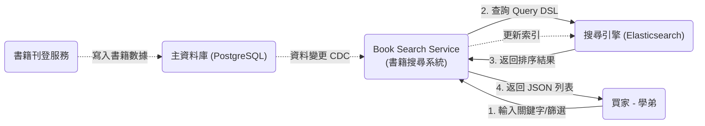
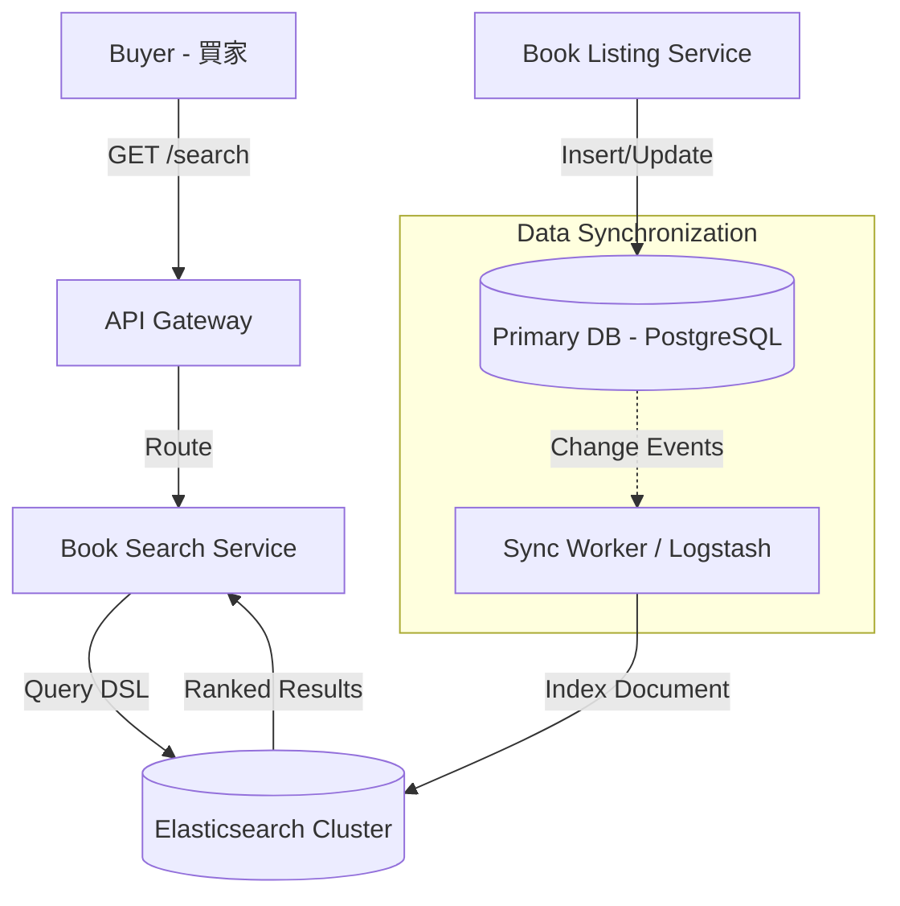
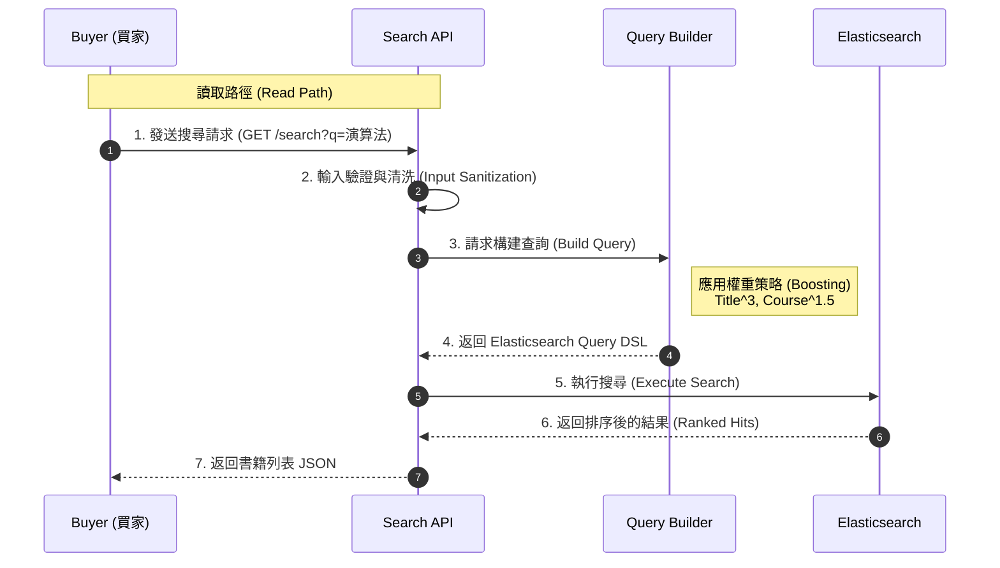
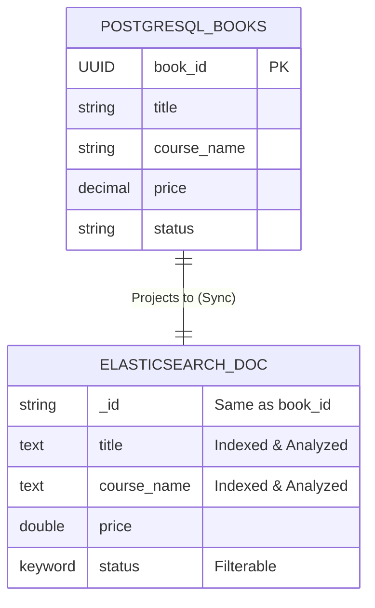

# 🔍 書籍搜尋系統 - 技術設計文件 (Book Search SDD)
---
## 1. Introduction
---
- **Purpose**: 定義「書籍搜尋模組」的技術架構、索引策略與查詢邏輯。旨在解決傳統關聯式資料庫無法滿足的高效能全文檢索與多維度篩選（書名、課程、老師）需求。
- **Scope**:
    * **In Scope (範圍內)**: 書籍搜尋 API (`GET /search/books`)、搜尋引擎 (Elasticsearch) 的索引結構設計 (Mapping)、加權排序演算法 (Ranking Logic)、資料庫與搜尋引擎之間的資料同步機制 (Data Sync)。
    * **Out of Scope (範圍外)**: 書籍的實際交易處理、圖片儲存細節（由 `book_display` 模組處理）。
- **Definitions and Acronyms**:
    * **Elasticsearch (ES)**: 分散式搜尋與分析引擎，本系統的核心組件，用於全文檢索。
    * **Inverted Index (倒排索引)**: 搜尋引擎使用的核心資料結構，用於快速將關鍵字映射到文檔。
    * **Relevance Score (關聯性分數)**: 根據匹配程度（如 TF-IDF/BM25 演算法）計算出的分數，用於搜尋結果排序。
    * **CDC (Change Data Capture)**: 變更資料擷取，指即時捕捉資料庫變更並同步到搜尋引擎的技術模式。
- **References**:
    * [功能需求文件] `../requirement/book_search_requirement.md`
    * [書籍展示設計] `../design/book_display_design.md` (定義了書籍原始資料來源)
    * [專案總覽] `../README.md`

---
## 2. System Overview
---
### System Description (系統描述)
書籍搜尋系統是一個專門優化讀取效能 (Read-Optimized) 的服務。它從主資料庫中同步書籍資料，建立全文索引，並提供一個低延遲的查詢介面，讓買家能透過書名、課程名稱、老師姓名等模糊關鍵字快速找到所需書籍。

### Design Goals (設計目標)

* **Performance (效能):** 確保 95% 的搜尋請求能在 **500ms** 內返回結果 (NFR-BS-P-001)。
* **Relevance (精準度):** 實作加權排序，確保「書名完全匹配」的結果排在「課程匹配」之前 (FR-BS-004)。
* **Freshness (即時性):** 書籍狀態變更（如已售出）必須在數秒內反映在搜尋結果中，避免買家看到無效庫存 (NFR-BS-A-001)。
* **Scalability (擴展性):** 架構需支援水平擴展，以應對未來書籍數量增長。

### Architecture Summary (架構摘要)

本模組採用 **CQRS (命令查詢職責分離)** 模式的變體：

* **寫入端 (Write Side):** `Book-Listing-Service` 負責寫入 Primary DB (PostgreSQL)。
* **同步端 (Sync Side):** 透過 **Sync Worker** 或事件驅動機制，將變更異步推送到 Elasticsearch。
* **讀取端 (Read Side):** `Book-Search-Service` 直接查詢 Elasticsearch 來獲取搜尋結果。

### System Context Diagram (上下文交換圖)


---
## 3. Architectural Design
---
### System Architecture Diagram (系統架構圖)


### Component Breakdown (組件拆解)

| 組件名稱 (Component) | 職責 (Responsibilities) | 互動對象 (Interactions) |
| :--- | :--- | :--- |
| **Search API Handler** | 接收前端的搜尋請求（關鍵字、篩選條件、分頁）；執行輸入驗證與預處理（例如：去除特殊字符、關鍵字正規化）。 | 接收來自 **API Gateway** 的流量；將請求轉發給 **Query Builder**。 |
| **Query Builder** | 將使用者的搜尋意圖（如：「演算法 老師A」）轉換為 **Elasticsearch Query DSL**。負責設定權重（Boosting），例如讓 `title` 欄位的權重高於 `description`。 | 被 **Search API Handler** 呼叫；向 **Elasticsearch** 發送查詢請求。 |
| **Data Sync Worker** | 負責維持 Primary DB 與 Elasticsearch 之間的資料一致性。監聽資料庫變更或定期輪詢，將最新的書籍狀態（如：已售出）更新到索引中。 | 讀取 **Primary DB** 的變更日誌；對 **Elasticsearch** 執行 Index/Update 操作。 |

### Technology Stack (技術棧)

| 類別 (Category) | 技術選型 (Technology) | 選擇理由 (Rationale) |
| :--- | :--- | :--- |
| **Search Engine** | **Elasticsearch** (v8+) | 業界標準的全文檢索引擎，支援倒排索引、模糊搜尋 (Fuzzy Search) 與高效能的聚合分析，滿足 500ms 內回傳的需求。 |
| **Backend Framework** | **Python (FastAPI)** 或 **Node.js** | 輕量且高效，適合處理搜尋請求的 JSON 轉換與邏輯處理。 |
| **Sync Mechanism** | **Logstash** 或 **Custom Worker** | 用於實現資料庫到搜尋引擎的 ETL (Extract, Transform, Load) 流程，確保資料新鮮度 (Freshness)。 |
| **Analyzer** | **IK Analyzer** (中文分詞器) | 針對中文書籍名稱（如「計算機概論」）進行正確斷詞，避免搜尋不到相關書籍的問題。 |

### Data Flow and Control Flow


---
## 4. Detailed Design
---
### Responsibilities (職責)
**Book Search Service** 專注於提供高效能的讀取服務，其主要職責包括：
1.  **查詢解析 (Query Parsing):** 解析使用者的自然語言查詢（例如：「演算法 老師A」），提取關鍵字與篩選條件。
2.  **搜尋執行 (Search Execution):** 將解析後的條件轉換為 Elasticsearch Query DSL，執行多欄位加權搜尋。
3.  **結果排序 (Ranking):** 根據相關性分數 (Relevance Score)、價格或時間對結果進行排序。
4.  **資料同步 (Data Sync):** 確保 Elasticsearch 中的索引資料與主資料庫保持最終一致性 (Eventual Consistency)。

### Interfaces/APIs (介面與 API)

#### Search Books API (`GET /api/v1/search/books`)
* **Inputs (輸入參數):**
    * `q` (Query String): 搜尋關鍵字 (如 "計算機概論")。
    * `filters` (Query Params): `price_min`, `price_max`, `condition` (NEW/USED), `course_name`, `teacher_name`。
    * `sort` (Query Param): `relevance` (預設), `price_asc`, `price_desc`, `created_at_desc`。
    * `page`, `limit`: 分頁參數。
* **Outputs (輸出資料):**
    * `200 OK`:
        ```json
        {
          "total": 120,
          "page": 1,
          "hits": [
            {
              "book_id": "uuid...",
              "title": "計算機概論",
              "price": 500,
              "score": 12.5, // 關聯性分數
              "highlight": { "title": ["<em>計算機</em>概論"] }
            }
          ]
        }
        ```

### Error Handling (錯誤處理策略)
* **無效參數:** 當 `price_min` < 0 或 `sort` 參數不合法時，回傳 `400 Bad Request` 並附帶錯誤欄位說明。
* **搜尋引擎不可用:** 若 Elasticsearch 連線失敗，系統應實作 **Circuit Breaker (斷路器)** 模式，暫時降級服務（例如回傳空的結果或快取資料），並回傳 `503 Service Unavailable`，避免拖垮整個系統。
* **空結果處理:** 當搜尋無結果時，回傳 `200 OK` 但 `hits` 為空陣列，並可提供「您是不是要找...」的模糊建議 (Did you mean)。

### Data Structures (關鍵資料結構 - Index Mapping)
Elasticsearch 的文檔結構 (Document Mapping) 設計如下：
* **`title`**: `text` (使用 IK Analyzer 分詞)，支援全文檢索。
* **`course_name`**: `keyword` (精確匹配) + `text` (分詞搜尋)。
* **`teacher_name`**: `keyword` + `text`。
* **`price`**: `double`，用於範圍篩選與排序。
* **`created_at`**: `date`，用於排序。
* **`status`**: `keyword`，用於過濾已下架書籍 (必須為 `AVAILABLE`)。

### Algorithms/Logic (演算法與邏輯)
* **Relevance Scoring (加權演算法):**
    * 採用 **Boolean Query** 結合 **Multi-match**。
    * **權重設定 (Boosting):**
        * `title` 權重設為 **3.0** (書名匹配最重要)。
        * `course_name` 權重設為 **1.5**。
        * `teacher_name` 權重設為 **1.0**。
        * `description` 權重設為 **0.5**。
* **Fuzzy Search (模糊搜尋):** 允許使用者輸入有少量錯別字（編輯距離 Edit Distance = 1~2），仍能找到相關書籍。

### State Management (狀態管理)
* **Stateless (無狀態):** 搜尋服務本身是無狀態的，所有查詢依賴於 Elasticsearch 的索引狀態。
* **Eventual Consistency (最終一致性):** 搜尋結果的狀態（如庫存）可能會有極短暫的延遲（取決於 Sync Worker 的同步頻率），系統設計上接受此延遲，但在使用者點擊進入詳情頁時，會再次向 Primary DB 確認最新狀態。
---
## 5. Database Design
---
### Tables/Collections (資料索引設計)

本模組的核心儲存層為 **Elasticsearch**。以下定義了 `books_index` 的 Mapping 結構，這是實現高效能搜尋與加權排序的基礎。

#### Elasticsearch Index: `books`
該索引儲存書籍的「讀取專用」視圖 (Read Model)，經過正規化處理以優化查詢速度。

| 欄位名稱 (Field) | 資料類型 (Type) | 分析器 (Analyzer) | 說明 (Description) |
| :--- | :--- | :--- | :--- |
| `book_id` | keyword | N/A | 對應 Primary DB 的 UUID，用於精確查找或更新。 |
| `title` | text | **ik_max_word** (中文細粒度分詞) | 書籍名稱，搜尋的主要目標欄位 (權重最高)。 |
| `course_name` | text | **ik_smart** (中文智能分詞) | 課程名稱，支援模糊搜尋。 |
| `teacher_name` | text | **ik_smart** | 老師姓名，支援模糊搜尋。 |
| `description` | text | ik_smart | 書籍描述或備註。 |
| `price` | double | N/A | 售價，用於範圍篩選 (`price_min`, `price_max`) 與排序。 |
| `condition` | keyword | N/A | 新舊程度 Enum (`NEW`, `USED`...)，用於精確過濾。 |
| `status` | keyword | N/A | 書籍狀態，搜尋時必須過濾 `term: { "status": "AVAILABLE" }`。 |
| `created_at` | date | N/A | 上架時間，用於「最新上架」排序。 |
| `seller_id` | keyword | N/A | 賣家 ID，用於過濾特定賣家的書籍。 |

---

### ER Diagram (資料映射關係圖)


### Migration Strategy (遷移與索引策略)

為了應對 Mapping 變更（例如：修改分詞器或新增搜尋欄位），我們採用 **Alias Switching (別名切換)** 策略來達成零停機更新。

1.  **使用別名 (Alias):** 應用程式始終讀取名為 `books_alias` 的別名，而非具體的索引名稱 (如 `books_v1`)。
2.  **重建索引 (Reindexing):**
    * 當 Mapping 需要變更時，建立新索引 `books_v2`。
    * 使用 Elasticsearch 的 `_reindex` API 將資料從 `books_v1` 遷移到 `books_v2`。
3.  **無縫切換 (Atomic Switch):**
    * 執行原子操作：將 `books_alias` 指向從 `books_v1` 切換到 `books_v2`。
    * 確認無誤後，刪除舊索引 `books_v1`。
